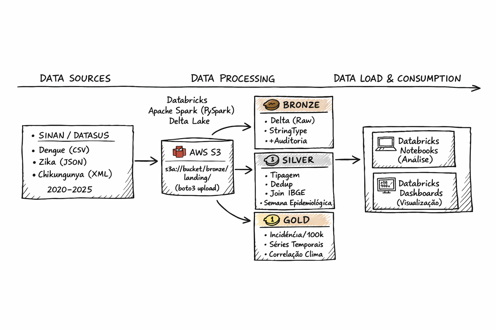

# 🦟 Pipeline Arbovirose Brasil — Medallion Architecture

> Pipeline de dados end-to-end para análise epidemiológica de **Dengue**, **Zika** e **Chikungunya** (2020–2024). Desenvolvido com **Spark**, **Delta Lake** e **AWS S3**.

---

## 🏗️ Arquitetura do Projeto

O pipeline segue a arquitetura **Medallion**, processando dados brutos do SINAN/DATASUS até métricas analíticas.



---

## 🏛️ Camadas do Pipeline

A arquitetura **Medallion** garante a qualidade e a confiabilidade do pipeline:

*   **🥉 Bronze (Raw)**: Ingestão dos microdados em seu estado bruto. Preservamos o formato original (CSV, JSON, XML) na zona de `landing` e convertemos para **Delta Lake**, adicionando colunas de auditoria (`_processado_em`, `ano`) e particionamento temporal.
*   **🥈 Silver (Trusted)**: Aplica limpeza e padronização. Realizamos a deduplicação de notificações, correção de tipos de dados (datas e geocódigos), além do enriquecimento com tabelas de referência do **IBGE** (Municípios/UF) e integração com dados meteorológicos do **INMET**.
*   **🥇 Gold (Analytics)**: Tabelas finais otimizadas para consumo. Aqui são calculadas as métricas de negócio, como a **Taxa de Incidência por 100k habitantes**, séries temporais agregadas e correlações entre variáveis climáticas e a propagação das arboviroses.

---

## 📅 Cronograma de Desenvolvimento

*   [x] **Marco 1: Infraestrutura e Camada Bronze**
    *   Setup AWS S3 + Databricks CE.
    *   Ingestão automatizada de CSV, JSON e XML do SINAN.
*   [ ] **Marco 2: Camada Silver e Enriquecimento**
    *   Deduplicação e padronização de tipos.
    *   Join com API IBGE e dados do INMET.
*   [ ] **Marco 3: Camada Gold e Analytics**
    *   Agregação de Taxas de Incidência/100k hab.
    *   Cálculo de correlação Clima x Casos (Pearson).
*   [ ] **Marco 4: Qualidade e Documentação**
    *   Implementação de Testes (pytest + Great Expectations).
    *   Dashboard final e README detalhado.

---

## 🛠️ Tecnologias e Ambiente

Projeto 100% construído sobre ferramentas gratuitas (**Free Tier**):

*   **Processamento**: Databricks Community Edition (Spark 3.5).
*   **Storage**: AWS S3 (via protocolo `s3a://`).
*   **Formato de Dados**: Delta Lake (ACID, Time Travel, Schema Evolution).
*   **Linguagem**: Python (PySpark, boto3, requests).

---

## 🚀 Como está estruturado

```
arbovirose-pipeline/
├── notebooks/
│   ├── bronze/     # Ingestão raw: CSV (Dengue), API/JSON (Zika) e XML (Chikungunya)
│   │   ├── 01_ingestao_dengue_csv.py
│   │   ├── 02_ingestao_zika_api.py
│   │   └── 03_ingestao_chikungunya_xml.py
│   ├── silver/     # Limpeza de nulos, tipagem e enriquecimento (IBGE/Clima)
│   │   ├── 04_limpeza_dedup.py
│   │   ├── 05_enriquecimento_ibge.py
│   │   └── 06_join_clima_inmet.py
│   ├── gold/       # Agregações analíticas e métricas de incidência
│   │   ├── 07_incidencia_municipio_semana.py
│   │   ├── 08_serie_temporal_uf.py
│   │   └── 09_correlacao_clima_casos.py
│   └── analytics/  # Visualizações e dashboard exploratório
│       ├── 10_dashboard_exploratorio.py
│       └── bronze_validacao_ingestao.ipynb
├── utils/          # Helpers de data, geo, schemas e Spark session
│   ├── date_utils.py
│   ├── geo_utils.py
│   ├── schema_definitions.py
│   └── spark_session.py
├── tests/          # Testes unitários para as camadas Bronze, Silver e Gold
│   ├── test_bronze_schemas.py
│   ├── test_silver_quality.py
│   └── test_gold_metrics.py
└── docs/           # Dicionários oficiais SINAN e rascunhos de arquitetura
    ├── dicionario_dados_*.pdf
    └── rascunho_diagrama.png
```

---

## 📊 Fontes de Dados

*   **Dengue/Zika/Chikungunya**: Microdados SINAN (DATASUS).
*   **Municípios**: API Localidades IBGE.
*   **Clima**: Dados históricos do INMET (BDMEP).

---

## 📈 Resultados e Métricas

O pipeline entrega visões consolidadas de:
1. **Taxa de Incidência**: Normalizada por 100k habitantes por semana epidemiológica.
2. **Sazonalidade**: Comparativo histórico (2020-2024).
3. **Correlação Climática**: Impacto da temperatura/chuva na propagação do vetor.

---

*Projeto desenvolvido como portfólio de engenharia de dados. Dados públicos governamentais brasileiros.*